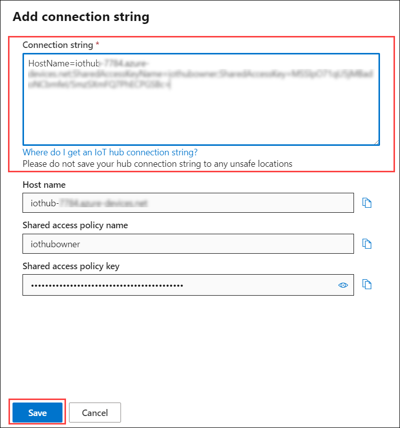

# 练习 1：Azure IoT 服务入门

## 应用场景

Fabrikam, Inc. 的*涡轮机（设备）*在全球各地都有部署。你需要配置 Azure IoT 中心解决方案，以可靠和可缩放的方式集中接收遥测和管理所有设备。

## 概述

在本练习中，你需要把部署在全球各地的设备连接到 Azure IoT 中心，并将遥测数据从涡轮机设备发送到 Azure IoT 中心。

您将采取以下行动来达成这一目标。

* 登录 Azure 门户，验证预创建的 Azure IoT 中心和其他资源。 
* 将（模拟）设备注册到 Azure IoT 中心。
* 启用（模拟）设备。
* 将遥测从设备发送到 Azure IoT 中心
* 在 Azure IoT 中心 IoT 资源管理器中查看遥测数据流

## 说明

### 实验室入门

1. 环境预配完毕后，一个虚拟机 (JumpVM) 和实验室指南会分别加载到浏览器左右两侧。在整个研讨会期间，请始终使用该虚拟机来执行实验室操作。

1. 要获得**“实验室环境”**的详细信息，可以选择右上角的**“实验室环境”**选项卡。此外，你在注册时提供的电子邮件地址也将收到相关凭据。

   

 > **“实验室环境”**选项卡上会显示 Suffix/DeploymentID 值。每当实验室步骤中要求填写 Suffix 或 DeploymentID 时，请输入该值。这是与每个实验室部署相关联的唯一编号。 
 
#### 任务 1：登录 Azure 门户并验证预部署资源

1. 在 JumpVM 中，双击桌面上的“Azure portal”（Azure 门户）快捷方式。

     

1. 登录到**“Microsoft Azure”**边栏选项卡后，会显示登录屏幕，在其中输入以下电子邮件地址或用户名，然后单击**“下一步”**。 
   * 电子邮件地址/用户名：<inject key="AzureAdUserEmail"></inject>

1. 现在输入以下密码并单击**“登录”**。
   * 密码：<inject key="AzureAdUserPassword"></inject>

1. 如果显示弹出窗口**“保持登录状态?”**，请单击“是”

1. 如果显示弹出窗口**“你有免费的 Azure 顾问建议!”**，请关闭该窗口并继续实验室步骤。

1. 如果出现弹出窗口**“欢迎使用 Microsoft Azure”**，请单击**“以后再说”**跳过此教程。
   
1. 在门户窗口的左上角，要打开**“资源组”**菜单，请单击切换菜单图标，然后单击**“资源组”**。

   

   此边栏选项卡显示了所有可以访问 Azure 订阅的资源组。

1. 你会看到一个预创建资源，名为**“iot-{deployment-id}”**。此资源组包含实验室所需的所有资源。选择该资源组，并查看资源组中预创建的资源。 

     

   > **备注：** **部署 ID** 是每份部署的唯一编号。可以在右上角的**“实验室环境”**选项卡中找到你的部署 ID。
    
#### 任务 2：将（模拟）涡轮机设备连接到 Azure IoT 中心

**IoT 中心**是一项 Azure 服务，用于将大量遥测从 IoT 设备引入云中进行存储或处理。可从如下网址找到更多关于 IoT 中心的参考资料：```https://docs.microsoft.com/en-us/azure/iot-hub/about-iot-hub```。

在本任务中，你需要将 Fabrikam, Inc. 的涡轮机设备连接到 Azure IoT 中心。连接后，需要配置涡轮机设备，以便向 IoT 中心发送遥测。以下是需要执行的概要步骤：

   * 将涡轮机设备注册到 IoT 中心
   * 启用你打算包含在解决方案中的注册设备
   * 开始将数据从设备发送到 IoT 中心。


1. 从右侧的**“环境详细信息”**选项卡中，复制 **IotHubConnectionString** 的值。该连接字符串将在接下来的步骤中用于建立 IoT 中心和模拟器应用之间的连接，以及建立与 Azure IoT 资源管理器的连接。

    > **备注**：也可以通过如下方式获取连接字符串：导航到 IoT 中心 -> 单击“设置”下的“共享访问”策略 -> 然后单击“策略”选项卡下的“iothubowner”，并复制“连接字符串 - 主键值”。

1. 最小化 Azure 门户，通过单击虚拟机桌面上的**“IoT simulator”**（IoT 模拟器）快捷方式打开**“IoT simulator”**（IoT 模拟器）应用。 

1. 将之前复制的**“连接字符串”**值粘贴到文本框中。

1. 单击右侧的**“连接”**按钮，与 IoT 中心建立连接。

1. 连接成功后，将弹出消息**“连接成功”**，单击**“确定”**，即可查看涡轮机设备列表。每项都代表一个你希望进行模拟设备安装的设备。

   
   
1. 在“IoT 模拟器”应用对话框中单击**“涡轮机-01”**旁边的**“注册”**，将设备注册到 IoT 中心。

   

1. 最小化**“IoT 中心模拟器应用”**，导航到资源组，并选择名为**“iothub-{deployment-id}”**的 IoT 中心。

1. 单击“资源管理器”部分下的**“IoT 设备”**，可以看到这里列出了已注册的 IoT 设备。
 
   

1. 打开“IoT Simulator”（IoT 模拟器）应用，单击已注册设备旁边的**“激活”**按钮，从而模拟在 IoT 中心注册表中将设备状态从“Disabled”（禁用）更改为“Enabled”（启用）。

   

   > **备注：重复以上步骤，注册并激活所有设备**。 
                  
1. 至此，你已注册并激活了设备。要查看此设备列表，请切换到 Azure 门户并选择 IoT 中心**“iot-hub-{deployment-id}”**。

  > **备注：你可能需要刷新浏览器才能看到这些设备**。 

1. 在“IoT 中心”边栏选项卡中，在左侧菜单的“资源管理器”下选择“IoT 设备”。

1. 你应该会看到列出的所有设备，其中已激活设备的状态为“Enabled”（启用）。

1. 回到 IoT 模拟器应用程序，单击**“发送遥测”**。在几分钟内，模拟器应用程序上的网格将列出所传输的每个遥测消息和模拟的温度值。

   
   
   现在，你已经将涡轮机配置为将温度数据发送到 Azure IoT 中心。 
   
#### 任务 3：在 Azure IoT 中心使用 IoT 资源管理器验证遥测流

**Azure IoT 资源管理器**是一种图形工具，用于与 IoT 即插即用预览设备交互和并对其进行测试。你可以使用该工具查看设备发送的遥测、处理设备属性和调用命令。可通过以下链接深入了解 Azure IoT 资源管理器：```https://docs.microsoft.com/en-us/azure/iot-pnp/howto-use-iot-explorer```

在此任务中，将使用 **Azure IoT 资源管理器**查看由模拟涡轮机设备发送到 Azure IoT 中心的遥测数据。

1. 单击虚拟机桌面上的**“Azure IoT Explorer”**（Azure IoT 资源管理器）快捷方式，启动 Azure IoT 资源管理器应用程序。

1. 单击“IoT Hub”（IoT 中心）窗格上的**“+ Add connection”**（+ 添加连接）。

   

1. 输入 IoT 中心的**“Connection string”**（连接字符串）值。在上一个任务中，此值曾用于连接涡轮机设备。

   > **备注**：可以在工作区右侧的**“环境详细信息”**选项卡下的 **IoTHubConnectionString **中找到**“Connection string”**（连接字符串）值。
   
1. 单击**“Save”**（保存）

   

1. 在**“Devices”**（设备）窗格下，可以看到你在上一个任务中连接和注册的 **IoT 设备**。

1. 单击设备列表中的**“turbine-01”**。

   

1. 从左侧选择**“Telemetry”**（遥测）并单击**“Start”**（开始）选项。

   

   这样便能监视发送到 IoT 中心的数据。还需要验证设备能否与 IoT 中心连接和通信。

1. 在 2-3 分钟内，你将收到遥测数据，并看到类似如下消息：查看样本数据，并审查温度值。 
    
   
  
1. 一旦确认 IoT 中心正在接收来自 Fabricam Inc 涡轮机设备的遥测，请按**“Stop”**（停止），然后关闭 **Azure IoT 资源管理器**应用程序。

   
   
在本任务中，你将 Fabrikam, Inc. 的涡轮机设备连接到了 Azure IoT 中心。还使设备将遥测发送到 IoT 中心，并验证了遥测流。
