# 练习 3：使用 Power BI 在 IoT 中实现机器学习和实时监视

## 应用场景

到目前为止，所有生成的见解都需要人工参与来检测异常。Fabrikam 希望利用 AI（人工智能）领域的技术进步来检测温度数据异常。  Fabrikam 还希望针对任何异常情况检测配置自动警报，并通过异常信息对数据流进行实时监视。   

你需要将解决方案配置为使用机器学习来检测异常，而不需要任何人工干预。还需要实现跨多个维度的数据流实时监视，并配置警报，以便在检测到任何异常时通知团队。

## 概述

在此练习中，你将使用内置的自动化机器学习模型来分析来自涡轮机设备的数据并检测异常，还将使用上一练习中的查询输出来可视化 Power BI 仪表板中的实时数据。

此练习包括以下任务：

* 使用 IoT 模拟器应用触发异常
* 使用内置机器学习模型检测异常
* 创建 Power BI 仪表板并可视化异常数据
* 配置在检测到异常时发出的警报 [只读]

### 任务 1：使用 IoT 模拟器应用触发异常

IoT 模拟器应用程序包括出于演示目的触发异常的选项。我们将在本任务中使用此功能。

1. 如果尚未运行，请在 VM 桌面启动 **IoT 模拟器应用**。确保模拟器已连接到 IoT 中心并正在发送遥测数据。 

1. 在“IoT 模拟器应用”对话框中，单击“停止遥测”旁边的**“异常”**按钮。这将触发向 IoT 中心发送异常。

    > **备注**：如果设备没有发送遥测数据，请确保启动 IoT 模拟器应用并通过发送遥测数据来模拟设备。
    
1. 网格上会显示已传输的遥测消息列表。观察模拟温度值。可以看到温度值飙升。

### 任务 2：使用内置机器学习模型检测异常

在此任务中，你将使用内置的 ML 模型来检测异常：

**内置机器学习模型** - AnomalyDetection_SpikeAndDip 函数使用滑动窗口来分析数据异常。例如，滑动窗口可以是最近两分钟的遥测数据。该窗口会随着遥测流以准实时的方式向前移动。如果滑动窗口增大以包含更多数据，那么异常情况检测的准确度也会增加（但延迟也会增加，所以必须找到平衡点）。

1. 在资源组磁贴中，单击**“iot-{deployment-id}”**，选择流分析作业**“iot-streamjob-{deployment-id}”**。如果该流分析作业正在运行，请停止它。

   > **备注**：在下一步中编辑查询之前，请确保流分析作业**已停止**。

1. 在**“作业拓扑”**下的左侧菜单中，单击**“查询”**。

1. 复制以下 SQL 查询，然后用现有查询替换它。

    ```sql
     WITH AnomalyDetectionStep AS
     (
       SELECT
           EventProcessedUtcTime AS time,
           CAST(temp AS float) AS temp,
           AnomalyDetection_SpikeAndDip(CAST(temp AS float), 90, 120, 'spikesanddips')
               OVER(LIMIT DURATION(second, 120)) AS SpikeAndDipScores
       FROM iothubinput
    )
       SELECT
           time,
           temp,
           CAST(GetRecordPropertyValue(SpikeAndDipScores, 'Score') AS float) AS
           SpikeAndDipScore,
           CAST(GetRecordPropertyValue(SpikeAndDipScores, 'IsAnomaly') AS bigint) AS
           IsSpikeAndDipAnomaly
      INTO powerbioutput
      FROM AnomalyDetectionStep;
      
      SELECT * INTO bloboutput FROM iothubinput;
      
      SELECT AVG(temp) AS AverageTemperature, id INTO servicebusoutput FROM iothubinput GROUP BY TumblingWindow(minute, 1), id HAVING AVG(temp) > 72 ;
    ```

    > **备注**：  该查询的第一部分获取温度数据，并检查前 120 秒的值。`AnomalyDetection_SpikeAndDip` 函数将返回一个 `Score` 参数和一个 `IsAnomaly` 参数。分数 (score) 是 ML 模型判定给定值为异常的确信程度，用百分比表示。当分数超过 90% 时，`IsAnomaly` 参数的值为 1，否则 `IsAnomaly` 的值为 0。注意查询第一部分中的 120 和 90 参数。查询的第二部分将时间、温度和异常参数发送给 `powerbioutput`。
 
    > **备注**：查询的第三部分，即 **SELECT AVG(temp) AS AverageTemperature, id INTO servicebusoutput FROM iothubinput GROUP BY TumblingWindow(minute, 1), id HAVING AVG(temp) > 72 ;**，查看进入“iothubinput”输入的事件，并按照一分钟的翻转窗口进行分组。然后，再将大于 72 的温度平均值和 id 发送到“servicebusoutput”输出。有关 `TumblingWindow` 函数的详细信息，请参考此链接：```https://docs.microsoft.com/en-us/stream-analytics-query/tumbling-window-azure-stream-analytics```

1. 验证查询编辑器现在是否列出了 1 个输入和 3 个输出：

    * `Inputs`
      * `iothubinput`
    * `Outputs`
      * `bloboutput`
      * `powerbioutput`     
      * `servicebusoutput`

    如果数目超过 1 项，那么说明查询、输入或输出名称中可能存在着拼写错误 - 请先纠正此问题后再继续。

1. 要保存查询，请单击**“保存查询”**。

1. 在左侧菜单中，单击**“概述”**。

1. 在边栏选项卡顶部附近，单击**“启动”**启动分析作业。

   > **备注**：如果流分析作业失败，请执行以下步骤：
     *  在“作业拓扑”下选择**“输出”**，然后选择**“powerbioutput”**
     * 在“PowerBi 输出”边栏选项卡中，单击“续订授权”，当系统提示输入 Azure 凭据时，请在“环境详细信息”标签页中提供 Azure 用户名和密码，然后单击“保存”。

1. 在**“启动作业”**窗格中，确保选中“作业输出”、**“启动时间”**下的**“立即”**，然后单击**“启动”**。

为了方便人工操作员解读该查询的输出，你需要以一种直观的方式来将数据可视化。其中一种实现这种可视化的方法是创建 Power BI 仪表板。你将在下一个练习中进行此操作。

### 任务 3：创建 Power BI 仪表板并可视化异常数据

在上一任务中，你已经通过 ML 模型配置了一个流分析作业以处理遥测，并将结果输出到 Power BI。在 Power BI 中，需要创建一个带有若干磁贴的仪表板来可视化结果，并为操作员提供决策支持。

为了实时分析数据，我们将使用 PowerBI 的一些内置功能以及 Azure 流分析功能，以适用于 PowerBI 的实时格式发送数据。

我们将使用 Power BI 的仪表板功能来创建可视化磁贴。一个磁贴包含平均温度测量值。另一个磁贴是一个仪表，显示指示值是异常值的置信度（从 0.0 到 1.0）。第三个磁贴指示是否达到 90% 的置信度。最后，第四个磁贴显示过去一小时内检测到的异常数量。通过将时间作为 x 轴，该图块可以清楚地显示出在短时间内连续检测到的一系列异常，因为这些异常会在水平方向上聚集在一起。

第四个磁贴能帮助你比较异常值。

1. 在浏览器中，再次导航到 ```https://app.powerbi.com/```。

1. 打开 Power BI 后，在左侧导航菜单中展开**“工作区”**，然后选择**“我的工作区”**。

1. 在**“数据集”**选项卡上，验证是否显示了**“temperaturedataset”**。
   
1. 在“我的工作区”页面上单击**“+ 新建”**，并从下拉列表中选择**“仪表板”**。

1. 在**“创建仪表板”**弹出窗口中的**“仪表板名称”**下，键入**“Temperature Dash”**，然后单击**“创建”**。

    新仪表板将显示为一个基本空白的页面。

1. 要添加一个温度仪表，请单击空白仪表板顶部的**“编辑”**，然后选择**“+ 添加磁贴”**。

1. 在**“添加磁贴”**窗格的**“实时数据”**下，单击**“自定义流式处理数据”**，然后单击**“下一步”**。

1. 在**“添加自定义流式处理数据磁贴”**窗格中，单击**“你的数据集”**下的**“temperaturedataset”**，然后单击**“下一步”**。

    窗格将刷新，之后便可选择一个可视化效果类型和若干字段。

1. 在**“可视化效果类型”**下，打开下拉列表，然后单击**“仪表”**。

1. 在**“值”**下，单击**“+ 添加值”**，打开下拉列表，然后单击**“temp”**。

    请注意，带有值的仪表会立即出现在仪表板上，并开始更新！

    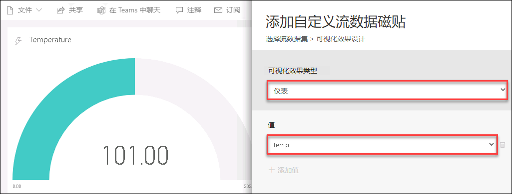
    
    > **备注**：  如果未显示 **temp**，请检查 IoT 模拟器应用和流分析作业是否在运行。同样，你可以停止发送异常 2 分钟，之后重新开始并等待 3-5 分钟。然后刷新页面，查看是否显示值。如果仍未显示，请在 IoT 模拟器应用上重新连接设备，方法是停用设备（确保停止发送所有遥测/异常），然后注销每台设备并重新注册设备。注册后，请启用并开始发送遥测。
    
1. 要显示“磁贴详细信息”窗格，请单击**“下一步”**。

1. 在**“磁贴详细信息”**窗格中，在**“磁贴”**下输入**“Temperature”**。

1. 保留其余字段的默认值，并单击**“应用”**。

    如果看到关于创建手机视图的通知，可以忽略它，它很快就会消失（或者你也可以亲自消除它）。

1. 若要缩小磁贴，请将鼠标悬停在磁贴右下角，然后单击并拖动调整大小鼠标指针。

    尽可能地缩小磁贴。它会对齐到各种预设大小。

1. 要添加 SpikeAndDipScore 簇状条形图，请单击仪表板顶部的**“编辑”**，然后选择**“+ 添加磁贴”**。

    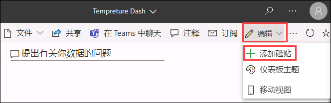

1. 在**“添加磁贴”**窗格的**“实时数据”**下，单击**“自定义流式处理数据”**，然后单击**“下一步”**。

1. 在**“添加自定义流式处理数据磁贴”**窗格中，单击**“你的数据集”**下的**“temperaturedataset”**，然后单击**“下一步”**。

   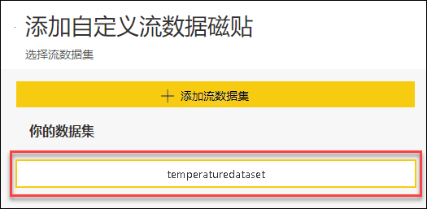

1. 在**“可视化效果类型”**下，打开下拉列表，然后单击**“簇状条形图”**。

    请注意，更改可视化类型会改变下面的字段。

1. 在**“值”**下，单击**“+ 添加值”**，打开下拉列表，然后单击**“SpikeAndDipScore”**。

   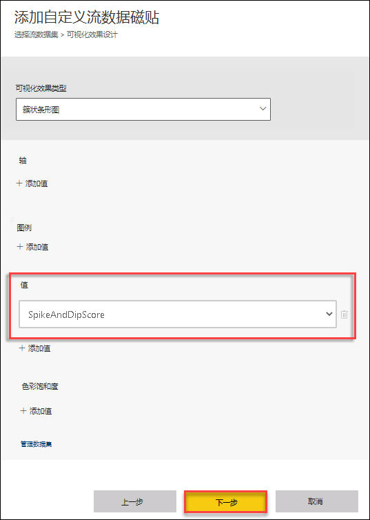

1. 要显示“磁贴详细信息”窗格，请单击**“下一步”**。

1. 在**“磁贴详细信息”**窗格中，在**“磁贴”**下输入**“SpikeAndDipScore”**

1. 要关闭“磁贴详细信息”窗格，请单击**“应用”**。

    如果看到关于创建手机视图的通知，可以忽略它，它很快就会消失（或者你也可以亲自消除它）。

1. 同样，尽可能地缩小磁贴。

1. 要添加 IsSpikeAndDipAnomaly 卡片可视化效果，请单击仪表板顶部的**“编辑”**并选择**“+ 添加磁贴”**。

1. 在**“添加磁贴”**窗格的**“实时数据”**下，单击**“自定义流式处理数据”**，然后单击**“下一步”**。

1. 在**“添加自定义流式处理数据磁贴”**窗格中，单击**“你的数据集”**下的**“temperaturedataset”**，然后单击**“下一步”**。

1. 在**“可视化效果类型”**下，打开下拉列表，然后单击**“卡片图”**。

1. 在**“字段”**下，单击**“+ 添加值”**，打开下拉列表，然后单击**“IsSpikeAndDipAnomaly”**。

1. 要显示“磁贴详细信息”窗格，请单击**“下一步”**。

   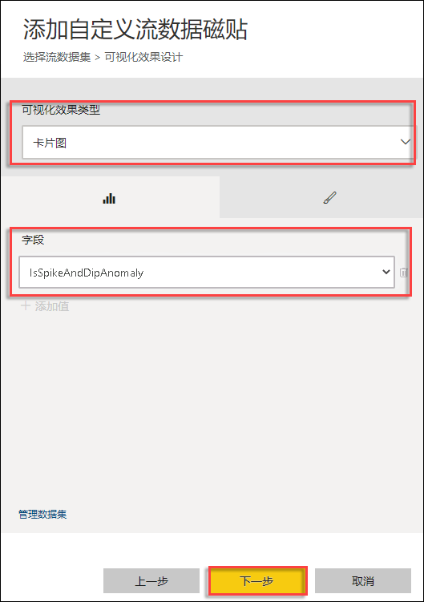

1. 在**“磁贴详细信息”**窗格中，在**“磁贴”**下输入**“Is Anomaly?”**

1. 要关闭“磁贴详细信息”窗格，请单击**“应用”**。

    如果看到关于创建手机视图的通知，可以忽略它，它很快就会消失（或者你也可以亲自消除它）。

1. 同样，尽可能地缩小磁贴。

1. 通过拖放操作在仪表板左侧垂直排列磁贴，顺序如下：

    * SpikeAndDipScore
    * Is Anomaly?
    * Temperature

1. 在仪表板顶部，单击**“编辑”**并选择**“+ 添加磁贴”**。

1. 在**“添加磁贴”**窗格的**“实时数据”**下，单击**“自定义流式处理数据”**，然后单击**“下一步”**。

1. 在**“添加自定义流式处理数据磁贴”**窗格中，单击**“你的数据集”**下的**“temperaturedataset”**，然后单击**“下一步”**。

    窗格将刷新，之后便可选择一个可视化效果类型和若干字段。

1. 在**“可视化效果类型”**下，打开下拉列表，然后单击**“簇状条形图”**。

    请注意，更改可视化类型会改变下面的字段。

1. 在**“轴”**下，单击**“+ 添加值”**，然后从下拉列表中选择**“time”**（时间）。

1. 在**“值”**下，单击**“+ 添加值”**，然后在下拉列表中选择**“IsSpikeAndDipAnomaly”**。

1. 在**“要显示的时间窗口”**下，打开**“最后一个”**右边的下拉列表，然后单击**“5”**。

    将单位设置为**“分钟”**。

1. 要显示“磁贴详细信息”窗格，请单击**“下一步”**。

   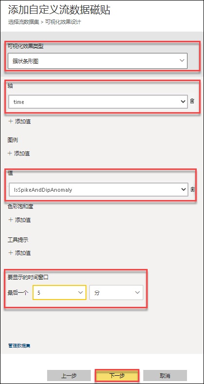

1. 在**“磁贴详细信息”**窗格中，在**“磁贴”**下输入**“Anomalies over the hour”**。

1. 要关闭“磁贴详细信息”窗格，请单击**“应用”**。

    如果看到关于创建手机视图的通知，可以忽略它，它很快就会消失（或者你也可以亲自消除它）。

1. 这次请拉伸磁贴，使其高度与左边的 3 个磁贴匹配，宽度与仪表板的剩余空间匹配。

    由于路径和连接众多，因此会存在延迟，但你应该会在可视化效果中开始看到涡轮机温度数据。

1. 验证 IoT 模拟器应用和分析作业是否在运行。

1. 在 **IoT 模拟器应用**中，开始发送 turbine-01 异常，持续 2-3 分钟，然后停止。

1. 让作业在 ML 模型启动之前运行一段时间（至少 3-5 分钟），以便在你配置的 Power BI 仪表板中查看波动情况。
    
1. 现在，应该可以看到如下所示的活动 Power BI 仪表板。

   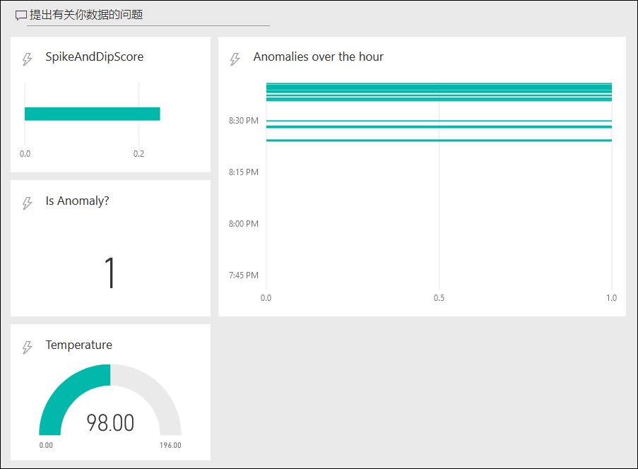

   > **备注**：请确保**停止**流分析作业并导航到 IoT 模拟器应用。然后依次单击**“停止异常”**、**“停止遥测”**按钮，停止发送每个设备的遥测流。

### 任务 4：在检测到异常时收到警报 [只读]

**** 
**这将是一个只读任务，因为所提供的实验室环境没有完成该任务所需的 D365 许可证。**
****

在此任务中，你将配置由**服务总线队列**触发的**逻辑应用**，并在 Dynamics 365 中添加记录。如果设备的平均温度超过特定值，数据将从流分析发送到服务总线队列。

1. 导航到你的资源组 **iot-{deploymentid}**，并选择逻辑应用**“iot-logicapp-{deployment-id}”**。

1. 从“逻辑应用设计器”窗格中选择**“空白的逻辑应用 +”**磁贴。

1. 在搜索框中输入**“azure service bus”**（azure 服务总线）作为筛选条件。从触发器列表中选择触发器**“一封或多封邮件到达队列时（自动完成）”**。

   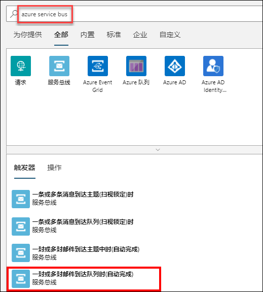
   
1. 当逻辑应用设计器提示输入连接信息时，请执行以下步骤。

   * 为连接提供一个名称，例如 **iotservicebusconnection**。
   * 选择**服务总线命名空间**。
   * 选择服务总线策略并选择**“创建”**。

1. 选择消息实体**“iotqueue”**。
    
1. 为你选择的触发器提供必要信息。要向操作添加其他可用属性，请打开“添加新参数”列表，并选择所需属性。例如，选择轮询间隔和检查队列的频率。

1. 在你想要添加操作的步骤下，选择**“+ 新建步骤”**。

1. 键入**“数据操作”**并从菜单中选择它。然后选择**“分析 JSON”**操作。

1. 选择以下表达式中的内容字段和源：
   **decodeBase64(Body()?[‘Content’])**
   
1. 单击**“使用示例有效负载生成架构”**，然后粘贴以下 JSON 示例有效负载。    

   **{"AverageTemperature":90,"id":"turbine-01"}**
   
1. **单击命令栏上的“保存”**。

  > 备注：在下一步中，你将为逻辑应用添加 Dynamics 365 连接器，即 Common Data Service

1. 单击流程上的**“+ 新建步骤”**，键入**“Common Data Service”**，选择**“Common Data Service”**，然后选择**“创建新记录”**操作。

   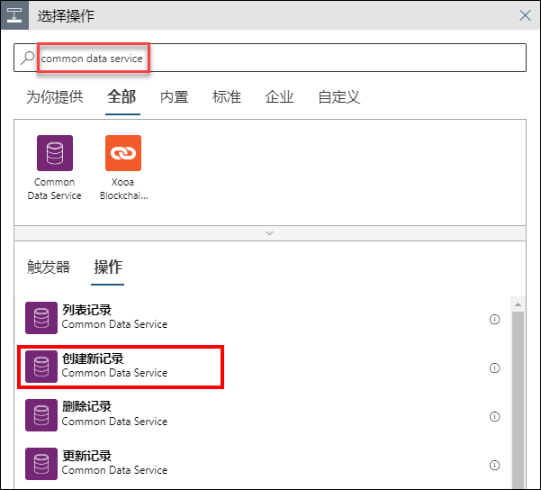

   **备注**：你将无法使用 CloudLabs 提供的凭据执行其余步骤，但可以通过浏览其余步骤了解如何配置警报。

1. 单击**“登录”**创建与 Common Data Service 的连接。

   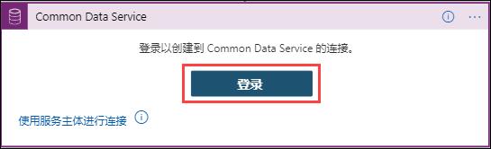

1. 从下拉列表中选择你的**环境**和实体**“Tasks”**（任务）。

   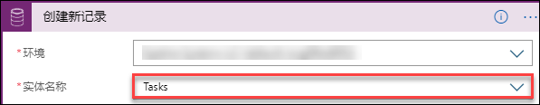
   
1. 现在，单击该部分底部的**“添加新参数”**，并选择“Record Created On”（记录创建时间）。

1. 在**“主题”**字段中，提供 **Alert - Device {Dynamic Content id } at { Expression utcNow() }**。对于动态内容和表达式，你需要选择“分析 JSON”下可用的动态内容中标识符的值，以及表达式中的 utcNow() 函数

   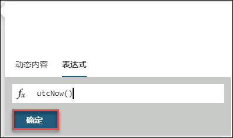

1. 在**“描述”**字段中，输入以下消息内容：

    ```text
     Alert - Average Temperature for Device  @{Dynamic Content['id']} is  @{Dynamic Content['AverageTemperature']}
    ```

1. 接下来，在“Records created on”（记录创建时间）字段中添加 Dynamics 表达式 utcNow()。

   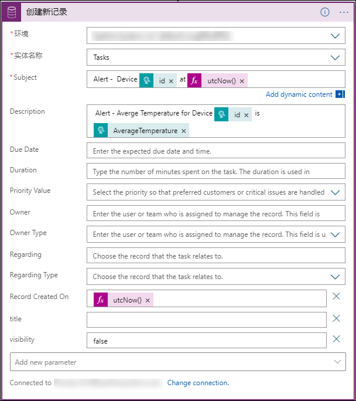
    
1. 正确配置逻辑应用后，当触发器触发时，Dynamics 365 任务中将显示相关条目。

    > **备注**：  浏览逻辑应用设计器，并在不**保存**更改的情况下继续进行下一练习。
    
在此练习中，你学习了如何使用内置机器学习模型来分析来自涡轮机设备的数据，以及如何在 Power BI 仪表板中将检测到的异常可视化。你还学习了如何通过基于服务总线的触发器，使用逻辑应用在 D365 中添加警报记录。
