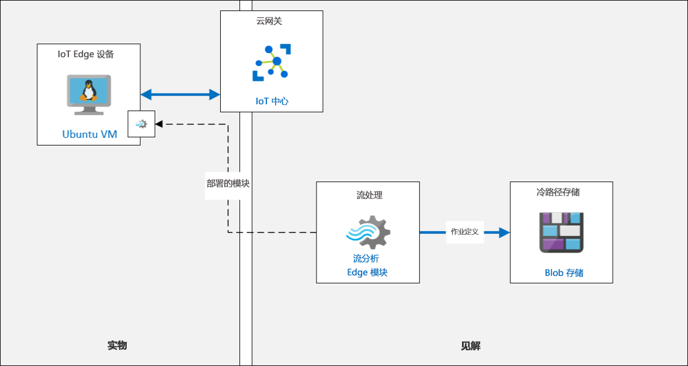
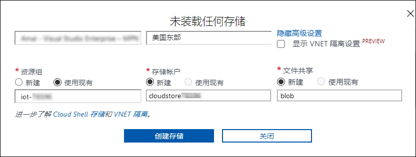
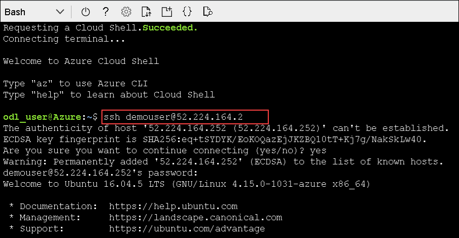

# 练习 4：Azure IoT Edge 入门

## 应用场景

随着大量设备的部署，大量数据正被收集并发送到云端。是否有可能将智能引入 Edge？

Fabrikam, Inc. 希望使用 IoT Edge 网关设备，将一些智能引入边缘用于进行即时处理。一部分数据仍将发送到云端。将数据智能引入 IoT Edge 还可以确保他们即使在本地网络很差的情况下，也能够处理数据并迅速做出反应。

你的任务是进行 Azure IoT Edge 解决方案的原型设计。首先，你将向设备部署一个流分析模块，用于计算平均温度，并在超出流程控制值时生成警报通知。

## 概述

在此练习中，你将向 Edge 设备部署一个流分析模块，并在超出流程控制值时生成警报通知。我们为你提供了预创建的基于 Linux 的 Azure VM，并将其配置为用于本实验室的 IoT Edge 设备。

在此练习中，你将完成以下任务：

* 连接到 IoT Edge VM
* 向 Edge 设备添加 Edge 模块
* 将 Azure 流分析 Edge 模块部署到 Edge 设备

Azure IoT Edge将在云中运行的云服务和在设备上程序的运行时间相结合。运行时启动并管理设备上的工作流。工作流包含一组容器，这些容器按特定顺序链接在一起，以创建端到端方案。IoT Edge 由 IoT 中心管理。Azure IoT Edge 使你能够在边缘设备上运行工作负荷，这些工作负荷是使用云服务开发的。工作负荷是使用与 docker 兼容的容器部署的模块。这些模块可以是人工智能应用程序、Azure 服务和第三方服务，也可以是业务逻辑。有关 IoT Edge 的详细信息，可导航到以下链接：```https://docs.microsoft.com/en-us/azure/iot-edge/about-iot-edge```

## 解决方案体系结构
 
  

### 任务 1：连接到 IoT Edge VM

在此任务中，你将连接到 IoT Edge VM，并验证 Azure IoT Edge 是否正在设备上运行。

1. 在 Azure 门户菜单上，单击**“资源组”**。
 
1. 在**“iot-{deployment-id}”**资源组中，单击 IoT Edge 虚拟机**“linuxagentvm-{deployment-id}”**。

1. 在**“概述”**窗格顶部，单击**“连接”**，然后单击**“SSH”**。

1. 在**“连接”**窗格中的“**4.运行以下示例命令以连接到你的 VM”**下，复制示例命令。

    这是一个可用于连接虚拟机的示例 SSH 命令，其中包含 VM 的 IP 地址和管理员用户名。该命令的格式应类似于 `ssh demouser@52.170.205.79`。

    > **备注**：你复制的示例命令包括 **-i <private key path>**，请使用文本编辑器删除这部分命令，然后将更新后的命令复制到剪贴板。
 
1. 通过导航到 **```https://shell.azure.com```** 并选择**“Bash”**打开 Azure Cloud Shell。

1. 单击**“显示高级设置”**，然后提供以下详细信息：

   * 资源组：选择**“使用现有”**->**“iot-{deployment-id}”**
   * 存储帐户：选择**“新建”**并输入**“cloudstore{deployment-id}”**
   * 文件共享：选择**“新建”**并输入**“blob”**
   
     >   **备注**：- 可从环境详细信息页面获取 **deployment-id** 详细信息。
        
   

1. 在 Azure Cloud Shell 命令提示符处，粘贴你在文本编辑器中更新的 `ssh` 命令，然后按 **Enter**。

1. 当系统提示**“是否确实要继续连接?”**时，请输入 `yes` 并按 **Enter**。

1. 当系统提示输入密码时，请输入**“Password.1!!”**并按 **Enter**。

   

1. 连接后，终端命令提示符将改为显示 Linux VM 的名称，类似如下所示。

    ```cmd/sh
    demouser@linuxagentvm-{deployment-id}:~$
    ```

    这将指明你已连接到哪个 VM。

    > **重要说明：**在连接时，系统可能会提示 Edge VM 的 OS 未完成更新。  在本实验室中，我们将忽略该提示，但在生产中，请始终确保 Edge 设备保持最新状态。

1. 要确认已在 VM 上安装 Azure IoT Edge 运行时，请运行以下命令：

    ```cmd/sh
    iotedge version
    ```

    该命令输出虚拟机上当前安装的 Azure IoT Edge 运行时版本。
    IoT Edge 设备上已安装 IoT Edge 运行时。IoT Edge 运行时是一个程序集合，可以将设备转变为 IoT Edge 设备。在 IoT Edge 运行时组件的共同作用下，IoT Edge 设备可以接收要在边缘上运行的代码，并向 IoT 中心传递结果。

### 任务 2：向 Edge 设备添加 Edge 模块

在此练习中，你将添加一个模拟温度传感器作为自定义 IoT Edge 模块，并将其部署到 IoT Edge 设备上运行。

IoT Edge 模块是以容器形式实现的可执行程序包。

通过 IoT Edge 模块，可以将云工作负荷部署到 IoT 设备上直接运行。IoT Edge 模块是由 IoT Edge 管理的最小计算单元。使用 IoT Edge 模块，可以在设备上（而非云中）分析数据。通过将部分工作负荷转移到边缘，你的设备可以花更少的时间向云发送消息，并更快地对事件做出反应。

1. 如有必要，请使用你的 Azure 帐户凭据登录 Azure 门户。
 
1. 在资源组磁贴上，单击**“iothub-{deployment-id}”**，以打开 IoT 中心。

1. 在**“IoT 中心”**边栏选项卡左侧，单击**“自动设备管理”**下的**“IoT Edge”**。

1. 在“IoT Edge 设备”列表中，单击**“turbine-06”**。

1. 在**“turbine-06”**边栏选项卡上，注意**“模块”**选项卡显示了当前为该设备配置的模块列表。

    目前，该 IoT Edge 设备只配置了 Edge 代理 (`$edgeAgent`) 模块和 Edge 中心 (`$edgeHub`) 模块，这些模块是 IoT Edge 运行时的一部分。

1. 在**“turbine-06”**边栏选项卡顶部，单击**“设置模块”**。

1. 在**“在设备 turbine-06 上设置模块”**边栏选项卡上，找到**“IoT Edge 模块”**部分。

1. 在**“IoT Edge 模块”**下单击**“添加”**，然后单击**“IoT Edge 模块”**。

1. 在**“添加 IoT Edge 模块”**窗格中，在**“IoT Edge 模块名称”**下输入**“turbinesensor”**

    我们将自定义模块命名为“turbinesensor”

1. 在**“映像 URI”**下，输入**“asaedgedockerhubtest/asa-edge-test-module:simulated-temperature-sensor”**

    > **备注**：此映像是 Docker Hub 上的已发布映像，由产品组提供，以支持此测试场景。

1. 要更改所选选项卡，请单击**“模块孪生设置”**。

1. 要为模块孪生指定所需属性，请输入以下 JSON：

    ```json
    {
        "EnableProtobufSerializer": false,
        "EventGeneratingSettings": {
            "IntervalMilliSec": 500,
            "PercentageChange": 2,
            "SpikeFactor": 2,
            "StartValue": 68,
            "SpikeFrequency": 20
        }
    }
    ```

    该 JSON 通过设置 Edge 模块的模块孪生所需属性来配置 Edge 模块。

1. 在边栏选项卡底部，单击**“添加”**。

1. 在**“在设备 turbine-06 上设置模块”**边栏选项卡底部，单击**“下一步: 路由 >”**。

1. 可以看到，已配置一个默认路由。

    * 名称：**route**
    * 值：`FROM /messages/* INTO $upstream`

    此路由将把来自 IoT Edge 设备上所有模块的所有消息发送到 IoT 中心

1. 单击**“查看 + 创建”**。

1. 在**“部署”**下，花一分钟查看显示的部署清单。 

    可以看到，IoT Edge 设备的部署清单使用 JSON 格式，这使其非常容易阅读。

    `properties.desired` 部分下的 `modules` 部分声明了将部署到 IoT Edge 设备的 IoT Edge 模块。这包括所有模块的映像 URI，包括任何容器注册表凭据。

    ```json
    {
        "modulesContent": {
            "$edgeAgent": {
                "properties.desired": {
                    "modules": {
                        "turbinesensor": {
                            "settings": {
                                "image": "asaedgedockerhubtest/asa-edge-test-module:simulated-temperature-sensor",
                                "createOptions": ""
                            },
                            "type": "docker",
                            "version": "1.0",
                            "status": "running",
                            "restartPolicy": "always"
                        },
    ```

    JSON 的下方是 **$edgeHub** 部分，其中包含 Edge 中心的所需属性。此部分还包括模块间和到 IoT 中心的事件路由的路由配置。

    ```json
        "$edgeHub": {
            "properties.desired": {
                "routes": {
                  "route": "FROM /messages/* INTO $upstream"
                },
                "schemaVersion": "1.0",
                "storeAndForwardConfiguration": {
                    "timeToLiveSecs": 7200
                }
            }
        },
    ```

    JSON 中再往下是对应 **turbinesensor** 模块的部分，其中 `properties.desired` 部分包含了边缘模块配置的所需属性。

    ```json
                },
                "turbinesensor": {
                    "properties.desired": {
                        "EnableProtobufSerializer": false,
                        "EventGeneratingSettings": {
                            "IntervalMilliSec": 500,
                            "PercentageChange": 2,
                            "SpikeFactor": 2,
                            "StartValue": 68,
                            "SpikeFrequency": 20
                        }
                    }
                }
            }
        }
    ```

1. 要完成设备模块的设置，请单击边栏选项卡底部的**“创建”**。

1. 在**“turbine-06”**边栏选项卡中的**“模块”**下，注意**“turbinesensor”**现已列出。

    > **备注**：可能必须单击**“刷新”**才能第一次看到该模块列出。

    你可能注意到尚未报告 **turbinesensor** 的运行时状态。

1. 在边栏选项卡顶部，单击**“刷新”**。

1. 可以看到 **turbinesensor** 模块的**“运行时状态”**现在设置为**“正在运行”**。

    如果仍未报告该值，请稍等一下，然后再次刷新边栏选项卡。
 
1. 打开一个 Cloud Shell 会话（如果尚未打开）。

    如果不再连接到 `vm-iot-edge-{deployment-id}` 虚拟机，请像以前一样使用 **SSH** 连接。

1. 要列出当前在 IoT Edge 设备上运行的模块，请在 Cloud Shell 命令提示符处输入以下命令：

    ```cmd/sh
    iotedge list
    ```

1. 该命令的输出类似如下所示。 

    ```cmd/sh
    demouser@linuxagentvm-{deployment-id}:~$ iotedge list
    NAME             STATUS           DESCRIPTION      CONFIG
    edgeHub          running          Up a minute      mcr.microsoft.com/azureiotedge-hub:1.0
    edgeAgent        running          Up 26 minutes    mcr.microsoft.com/azureiotedge-agent:1.0
    turbinesensor    running          Up 34 seconds    asaedgedockerhubtest/asa-edge-test-module:simulated-temperature-sensor
    ```

    请注意，`turbinesensor` 作为正在运行的模块之一列出。

1. 要查看模块日志，请输入以下命令：

    ```cmd/sh
    iotedge logs turbinesensor
    ```

    该命令的输出类似如下所示：

    ```cmd/sh
    demouser@linuxagentvm-{deployment-id}:~$ iotedge logs turbinesensor
    11/14/2019 18:05:02 - Send Json Event : {"machine":{"temperature":41.199999999999925,"pressure":1.0182182583425192},"ambient":{"temperature":21.460937846433808,"humidity":25},"timeCreated":"2019-11-14T18:05:02.8765526Z"}
    11/14/2019 18:05:03 - Send Json Event : {"machine":{"temperature":41.599999999999923,"pressure":1.0185790159334602},"ambient":{"temperature":20.51992724976499,"humidity":26},"timeCreated":"2019-11-14T18:05:03.3789786Z"}
    11/14/2019 18:05:03 - Send Json Event : {"machine":{"temperature":41.999999999999922,"pressure":1.0189397735244012},"ambient":{"temperature":20.715225311096397,"humidity":26},"timeCreated":"2019-11-14T18:05:03.8811372Z"}
    ```

    `iotedge logs` 命令用于查看任何 Edge 模块的模块日志。

1. 模拟温度传感器模块将在发送 500 条消息后停止运行。可通过运行以下命令将其重启：

    ```cmd/sh
    iotedge restart turbinesensor
    ```

    现在不需要重启该模块，但是如果稍后发现它停止发送遥测，那么请返回 Cloud Shell，通过 SSH 连接到 Edge VM，然后运行此命令重置它。重置后，该模块将再次开始发送遥测。

### 任务 3：以 IoT Edge 模块的形式部署 Azure 流分析

现在，**turbinesensor** 模块已在 IoT Edge 设备上部署和运行，我们可以添加一个流分析模块，用于在 IoT Edge 设备上处理消息，然后再将消息发送到 IoT 中心。

#### 检查流分析作业

1. 在资源组磁贴中，单击**“iot-{deployment-id}”**，选择流分析作业**“iotedge-streamjob-{deployment-id}”**。

1. 然后，在边栏选项卡左侧的**“作业拓扑”**下，选择**“输入”**，并验证是否存在已定义的输入作业**“temperature”**。

1. 然后在**“作业拓扑”**下选择**“输出”**，并验证是否存在已定义的输出作业**“alert”**。

1. 在**“配置”**下的左侧导航菜单中，单击“存储帐户设置”。然后，确保已添加存储帐户 otstorage{deployment-id}。

#### 部署流分析作业

1. 在 Azure 门户中，导航到**“iothub-{deployment-id}”**IoT 中心资源。

1. 在左侧导航菜单的**“自动设备管理”**下，单击**“IoT Edge”**。

1. 在**“设备 ID”**下，单击**“turbine-06”**。

1. 在**“turbine-06”**窗格顶部，单击**“设置模块”**。

1. 在**“在设备 turbine-06 上设置模块”**窗格中，找到**“IoT Edge 模块”**部分。

1. 在**“IoT Edge 模块”**下单击**“添加”**，然后单击**“Azure 流分析模块”**。

1. 在**“Edge 部署”**窗格中的**“订阅”**下，确保选中你在本课程中使用的订阅。

1. 在**“Edge 作业”**下拉列表中，确保选中**“iotedge-streamjob-{deployment-id}”**流分析作业。

    > **备注**：可能存在已经选中作业、但**“保存”**按钮处于禁用状态的情况。这时，请再次打开**“Edge 作业”**下拉列表，并再次选择**“iotedge-streamjob-{deployment-id}”** 作业。然后，**“保存”**按钮应该就会变为启用状态。

1. 在窗格底部，单击**“保存”**。

    部署可能需要一些时间。

1. 在设备上**设置模块的底部：涡轮机-06** 刀片，点击**查看 + 创建**。

1. 在**查看 + 创建**标签上，注意**部署清单** JSON 现已更新按 Stream Analytics 模块和刚配置的路由定义进行更新。

1. 在刀片底部点击**创建**。

1. 请注意，Edge 程序包成功发布后，新的 ASA 模块将在**“IoT Edge 模块”**部分下列出

1. 在**“IoT Edge 模块”**下，单击**“iotedge-streamjob-{deployment-id}”**。

    这是刚刚添加到 Edge 设备的流分析模块。

1. 在**“更新 IoT Edge 模块”**窗格中，请注意**“映像 URI”**指向一个标准 Azure 流分析映像。

    ```text
    mcr.microsoft.com/azure-stream-analytics/azureiotedge:1.0.7
    ```

    这是部署到 IoT Edge 设备上的每一个 ASA 作业所使用的同一映像。

    > **备注**：  配置的**映像 URI** 末尾的版本号将反映创建流分析模块时的当前最新版本。

1. 保留所有默认值，然后关闭**“IoT Edge 自定义模块”**窗格。

1. 在**“在设备 turbine-06 上设置模块”**窗格中，单击**“下一步: 路由 >”**。

    可以看到显示了现有路由。

1. 将定义的默认路由替换为以下三个路由：
   
   > **备注**：确保将 `iotstreamjob-edge-{deployment-id}` 占位符替换为 Azure 流分析作业模块的名称。
   
    * 路由 1
        * 名称：**telemetryToCloud**
        * 值：`FROM /messages/modules/turbinesensor/* INTO $upstream`
    * 路由 2
        * 名称：**alertsToReset**
        * 值：`FROM /messages/modules/iotedge-streamjob-{deployment-id}/* INTO BrokeredEndpoint("/modules/turbinesensor/inputs/control")`
    * 路由 3
        * 名称：**telemetryToAsa**
        * 值：`FROM /messages/modules/turbinesensor/* INTO BrokeredEndpoint("/modules/iotedge-streamjob-{deployment-id}/inputs/temperature")`

    > **备注**：可以单击**“上一步”**查看模块及其名称的列表，然后单击**“下一步”**返回到此步骤。

    所定义的路由如下：

    * **telemetryToCloud** 路由将来自 `turbinesensor` 模块输出的所有消息发送到 Azure IoT 中心。
    * **alertsToReset** 路由将来自流分析模块输出的所有警报消息发送到 **turbinesensor** 模块的输入。
    * **telemetryToAsa** 路由将来自 `turbinesensor` 模块输出的所有消息发送到流分析模块输入。

1. 在设备上**设置模块的底部：涡轮机-06** 刀片，点击**查看 + 创建**。

1. 在**查看 + 创建**标签上，注意**部署清单** JSON 现已更新按 Stream Analytics 模块和刚配置的路由定义进行更新。

1. 注意 `turbinesensor` 模拟温度传感器模块的 JSON 配置：

    ```json
    "turbinesensor": {
        "settings": {
            "image": "asaedgedockerhubtest/asa-edge-test-module:simulated-temperature-sensor",
            "createOptions": ""
        },
        "type": "docker",
        "version": "1.0",
        "status": "running",
        "restartPolicy": "always"
    },
    ```

1. 注意之前配置的路由的 JSON 配置，以及这些路由在 JSON 部署定义中的配置方式：

    ```json
    "$edgeHub": {
        "properties.desired": {
            "routes": {
                "telemetryToCloud": "FROM /messages/modules/turbinesensor/* INTO $upstream",
                "alertsToReset": "FROM /messages/modules/iotedge-streamjob-{deployment-id}/* INTO BrokeredEndpoint(\\\"/modules/turbinesensor/inputs/control\\\")",
                "telemetryToAsa": "FROM /messages/modules/turbinesensor/* INTO BrokeredEndpoint(\\\"/modules/iotedge-streamjob-{deployment-id}/inputs/temperature\\\")"
            },
            "schemaVersion": "1.0",
            "storeAndForwardConfiguration": {
                "timeToLiveSecs": 7200
            }
        }
    },
    ```

1. 在刀片底部点击**创建**。

#### 查看数据

1. 回到你通过 **SSH** 连接到 **IoT Edge 设备**时所处的 **Cloud Shell** 会话。  

    > **备注**：如果连接已关闭或超时，请重新连接。像之前一样运行 `SSH` 命令并登录。

1. 在命令提示符处输入以下命令，查看设备上部署的模块列表：

    ```cmd/sh
    iotedge list
    ```

    将新的流分析模块部署到 IoT Edge 设备可能需要一分钟时间。部署后，它就会出现在该命令的列表输出中。

    ```cmd/sh
    demouser@linuxagentvm-{deployment-id}:~$ iotedge list
    NAME                       STATUS           DESCRIPTION      CONFIG
    iotedge-streamjob-232539   running          Up a minute      mcr.microsoft.com/azure-stream-analytics/azureiotedge:1.0.5
    edgeAgent                  running          Up 6 hours       mcr.microsoft.com/azureiotedge-agent:1.0
    edgeHub                    running          Up 4 hours       mcr.microsoft.com/azureiotedge-hub:1.0
    turbinesensor              running          Up 4 hours       asaedgedockerhubtest/asa-edge-test-module:simulated-temperature-sensor
    ``` 

    > **备注**：  如果流分析模块没有出现在列表中，请等待一两分钟，然后再试一次。在 IoT Edge 设备上更新模块部署可能需要一分钟时间。

1. 请在命令提示符处输入以下命令，查看 `turbinesensor` 模块从 Edge 设备发送的遥测：

    ```cmd/sh
    iotedge logs turbinesensor
    ```

1. 花一分钟观察输出。
 
    此事件的输出类似如下所示：

    ```cmd/sh
    11/14/2019 22:26:44 - Send Json Event : {"machine":{"temperature":231.599999999999959,"pressure":1.0095600761599359},"ambient":{"temperature":21.430643635304012,"humidity":24},"timeCreated":"2019-11-14T22:26:44.7904425Z"}
    11/14/2019 22:26:45 - Send Json Event : {"machine":{"temperature":531.999999999999957,"pressure":1.0099208337508767},"ambient":{"temperature":20.569532965342297,"humidity":25},"timeCreated":"2019-11-14T22:26:45.2901801Z"}
    Received message
    Received message Body: [{"command":"reset"}]
    Received message MetaData: {"MessageId":null,"To":null,"ExpiryTimeUtc":"0001-01-01T00:00:00","CorrelationId":null,"SequenceNumber":0,"LockToken":"e0e778b5-60ff-4e5d-93a4-ba5295b995941","EnqueuedTimeUtc":"0001-01-01T00:00:00","DeliveryCount":0,"UserId":null,"MessageSchema":null,"CreationTimeUtc":"0001-01-01T00:00:00","ContentType":"application/json","InputName":"control","ConnectionDeviceId":"turbine-06","ConnectionModuleId":"vm-iot-edge-CP1119","ContentEncoding":"utf-8","Properties":{},"BodyStream":{"CanRead":true,"CanSeek":false,"CanWrite":false,"CanTimeout":false}}
    Resetting temperature sensor..
    11/14/2019 22:26:45 - Send Json Event : {"machine":{"temperature":320.4,"pressure":0.99945886361358849},"ambient":{"temperature":20.940019742324957,"humidity":26},"timeCreated":"2019-11-14T22:26:45.7931201Z"}
    ```
 
1. 在观察 **turbinesensor** 发送的温度遥测时，请注意流分析作业在 `machine.temperature` 的平均值超过 `72` 时发送的 **reset** 命令。这是在流分析作业查询中配置的操作。

在本练习中，你使用了 Azure IoT Edge 服务来处理 Edge 设备上的消息。
